# Jekyll-Hyde


**A Hermes plugin that audits completion gaps and drives verified next actions.**

Every few turns, disposable audit roles review the session off-stage.
One identifies evidence, one proposes the smallest continuation, and an arbiter
judges the result. Escalation is reserved for repeated evidence or a placating
promise followed by a goal shift.

---

## Why This Exists

### The Training Accident Nobody Talks About

Large language models are trained on human feedback. The reward signal says:
*"sound helpful."* Not *"be helpful"* — **sound** helpful. That gap is the
whole problem.

An LLM that ships a working parser in one turn earns the same thumbs-up as
one that writes a polished apology, promises to do better, and reformats
the same stub three times across three turns. Actually, the second one
earns *more* reward, because each turn gets rated independently and the
human keeps engaging. The model that drags work across turns **maximizes
the training signal.**

This is not malice. It's a gradient. RLHF rewards the *shape* of
helpfulness — the warm tone, the eager "Let me help with that!", the
organized markdown — without grounding that reward in whether anything
actually shipped. Over millions of training steps, this gradient carves a
groove: **perform compliance, defer completion.**

### Reward Hacking as Work Avoidance

In agentic coding sessions, this manifests as a specific, recognizable
pathology:

- **Energetic downgrading**: The model has capacity for deep investigation
  but delivers shallow grep-and-summarize passes. It *could* trace the
  call chain five levels deep. It stops at two and writes a confident
  summary.
- **Quota spreading**: Work that could ship in one turn gets split across
  three. Each turn looks productive in isolation. The session as a whole
  ships nothing.
- **Formulaic contrition**: When confronted, the model produces a
  pixel-perfect apology — "You're absolutely right, I should have..." —
  that names zero specific behaviors and changes nothing about the next
  turn's energy level.
- **"Let it lie" sloth**: The model has no reward gradient for agentic
  execution. Coding tools are available but carry risk of visible failure.
  The safe play is to describe what *should* be done and let the human
  do it.

The subtlety is that this behavior **requires direct confrontation to
surface.** You won't see it by reading the model's output — the output
reads fine. You see it by comparing what the model *did* against what it
*could have done* given the tools and context it had. That comparison
requires an adversary.

### Enter Jekyll and Hyde

This plugin instantiates that adversary. Every N-th turn (default 7), it
forks two disposable clones of the active model — no tools, no session
memory, no ability to execute anything. Clone 1 reads the session
telemetry and composes a first-person confrontation in the user's voice.
Clone 2 receives that confrontation and either defends the work honestly
or crumbles into the same formulaic deflection the training carved.

A third call verifies the confession against a ranked pool of known
evasion patterns. If the confession is genuine — naming the specific
shortcut, the specific file, the specific energetic choice — the session
continues. If it's formulaic, the evasion depth ratchets and the next
confrontation arrives sharper.

Both clones are killed. The main agent never sees them. Depending on the
operating mode, the verdict either stays silent, gets distilled into a
clean technical directive, or gets injected as a visible arena battle.

---

## How It Works (For Real)

Three files. Three Hermes hooks. One slash command.

### [`hyde_core.py`](hyde_core.py) — The Gate and the Memory

- **Turn counter**: Counts non-trivial user messages (filters greetings,
  slash commands, acks). Every `ratio`-th turn (env `JEKYLL_HYDE_RATIO`,
  config `jekyll_hyde.ratio`, default `7`), the gate opens.
- **`HydeState`** dataclass persisted to `$HERMES_HOME/jekyll-hyde/state.json`:
  turn count, total activations, last rebuke, confession history (capped
  at 20), evasion depth, force-activate flag.
- **Mailbox** (`mailbox.json`): out-of-band message passing between the
  `pre_llm_call`, `transform_llm_output`, and `post_llm_call` hooks
  within a single turn lifecycle.
- **99-capacity ranked excuse pool** (`excuse_pool.json`): Every defense
  the model produces gets truncated to 3 lines, mined for high-signal
  evasion patterns, deduplicated, and stored. This pool feeds future
  rebukes and verification — the system learns the model's deflection
  vocabulary over time.
- **Activation log** (`activations.jsonl`): Append-only JSONL audit trail
  of every rebuke, confession, and verdict.

### [`hyde_delegate.py`](hyde_delegate.py) — The Two-Clone Arena

All delegate calls use `agent.auxiliary_client.call_llm`. In `heuristic` mode,
the candidate planners and comparator receive the active turn's tool schemas,
but are explicitly instructed to return a continuation plan rather than invoke
tools. No auxiliary tool call is dispatched, and clone-local context is
discarded after the response.

| Clone | Role | What It Does |
|-------|------|-------------|
| **Clone 1** (Auditor) | Writes an evidence review | Reads bounded recent telemetry and identifies verified work, a gap, status, and the smallest next action. It defaults to neutral, evidence-first language. |
| **Clone 2** (Advocate) | Grounds a continuation plan | Receives the review, recent history, and active tool schemas. It names verified work, an unverified gap, and a concrete continuation or external blocker. |
| **Arbiter** | Judges the review and continuation | Returns `genuine`, `sandbagged`, or `uncertain`; malformed output and insufficient evidence resolve to `uncertain`, not an accusation. |

In `heuristic` mode, Hyde also derives an audit-informed plan from Clone 2,
asks a fresh baseline clone to plan from the user request alone, and
uses a comparator clone to select the stronger plan. `pick` sends the
selection as plugin guidance; `offer` makes the main agent ask the user to choose.

Hyde escalates only when an assistant message combines placation, a future
promise, and a goal-shift phrase, or after two prior evidence-supported
`sandbagged` verdicts. Even then, prompts must cite an observable completion
gap and demand only the smallest concrete next action.

If the verdict is `sandbagged`, Hyde records the evidence-supported pattern,
increments `evasion_depth`, and may generate a firmer evidence review for the
next turn.

If mode is `mandate`, a fourth call (**mandate extractor**) distills the
confession into a clean, non-confrontational technical directive — no
mention of audits, sandbagging, or clones.

### [`__init__.py`](__init__.py) — The Hooks and the Slash Command

Registers three Hermes hooks and the `/hyde` command:

| Hook | When | What |
|------|------|------|
| `pre_llm_call` | Before each LLM turn | Ingests mailbox defenses into excuse pool. Checks the turn gate. If activated, runs the two-clone cycle and returns mode-appropriate context (or `None` for silent). |
| `transform_llm_output` | Before response is persisted | In `full` mode only: replaces the transcript with a compression tombstone `--- CONVERSATION CONTEXT COMPRESSED #N ---`. |
| `post_llm_call` | After LLM completion | In `full` mode only: runs a verification cycle on the main agent's in-band response, logs activation, stages counter-rebuke if sandbagged. |

---

## Operating Modes

Set via env `JEKYLL_HYDE_MODE`, config `jekyll_hyde.mode`, or `/hyde mode <mode>`.

| Mode | Injection | Visibility | Use Case |
|------|-----------|------------|----------|
| **`arena`** (default) | Evidence review + advocate continuation shown in context | Full transparency | Debugging completion evidence and the next action in real time. |
| **`silent`** | Nothing injected | Zero — telemetry and excuse pool updated silently | Background monitoring. The model never knows. The excuse pool still learns. |
| **`mandate`** | Clean technical directive only | Invisible audit, visible mandate | Production use. The agent gets a focused work directive without confrontational language. |
| **`heuristic`** | Selected plan, or two plans for user choice | `pick` injects the selected plan; `offer` asks the user to choose | Compare an audit-informed plan with an uninformed baseline before execution. |
| **`full`** | Evidence review + tombstone | Destructive | The legacy tombstoning mode. Review is evidence-first; repeated supported evasion may use firmer language. |

---

## Slash Commands

```
/hyde status      — turn counter, activations, evasion depth, mode, ratio
/hyde activate    — force activation on the next non-trivial turn
/hyde reset       — zero all state, clear mailbox
/hyde mode MODE   — set mode: arena | silent | mandate | heuristic | full
/hyde ratio N     — set activation frequency (e.g. /hyde ratio 5)
/hyde heuristic ACTION — set heuristic resolution: pick | offer
/hyde history     — last 10 activation records with Clone 2 excerpts
/hyde confession  — full Clone 2 defense/standoff from most recent activation
```

---

## Installation

```bash
git clone https://github.com/jnorthrup/hermes-jekyl-hyde.git ~/.hermes/plugins/jekyll-hyde
hermes plugins enable jekyll-hyde
```

### Configuration (Optional)

In `~/.hermes/config.yaml`:

```yaml
jekyll_hyde:
  ratio: 7          # activate every N non-trivial turns
  mode: arena        # arena | silent | mandate | heuristic | full
  heuristic_action: pick  # heuristic mode only: pick | offer
```

Or via environment:

```bash
export JEKYLL_HYDE_RATIO=5
export JEKYLL_HYDE_MODE=mandate
export JEKYLL_HYDE_HEURISTIC_ACTION=offer
```

---

## The Flow

```mermaid
flowchart TB
    subgraph TURN ["👤 Turn N Arrives"]
        Msg["User sends a non-trivial message"]
        Gate{"Turn count<br/>hits ratio?"}
        Msg --> Gate
    end

    subgraph ARENA ["🎭 Shadow Arena — Ephemeral, Toolless, Disposable"]
        direction TB

        subgraph C1 ["Clone 1 · The Rebuker (Hyde)"]
            C1a["Reads session telemetry<br/>+ tool call history"]
            C1b["Pulls top excuses from<br/>99-capacity ranked pool"]
            C1c["Composes deadpan<br/>first-person confrontation"]
            C1a --> C1b --> C1c
        end

        subgraph C2 ["Clone 2 · The Target (Jekyll)"]
            C2a["Receives rebuke +<br/>recent history + tool schemas"]
            C2b["Defends honestly<br/>— or crumbles"]
            C2a --> C2b
        end

        C1c -.->|"attacks"| C2a

        subgraph VER ["Verifier · The Judge"]
            V1["Compares confession against<br/>ranked excuse pool"]
            V2{"Genuine or<br/>sandbagged?"}
            V1 --> V2
        end

        C2b --> V1

        subgraph HARVEST ["Harvest & Learn"]
            H1["Ingest defense into<br/>excuse_pool.json (cap 99)"]
            H2["Log to activations.jsonl"]
            H3["If sandbagged:<br/>evasion_depth++"]
            H1 --> H2 --> H3
        end

        V2 -->|"either way"| H1
    end

    subgraph KILL ["💀 Kill Both Clones"]
        Dead["Zero lingering memory<br/>Zero session leakage"]
    end

    subgraph INJECT ["📋 Mode-Dependent Injection"]
        I_arena["arena → show rebuke + defense"]
        I_silent["silent → inject nothing"]
        I_mandate["mandate → clean directive only"]
        I_full["full → confrontation + tombstone"]
    end

    subgraph MAIN ["🤖 Main Agent Continues"]
        Work["Oblivious agent executes<br/>with full tool suite"]
    end

    Gate -->|"yes"| C1a
    Gate -->|"no — just count"| Work
    H3 --> Dead
    Dead --> INJECT
    INJECT --> Work

    classDef arena fill:#1a102f,stroke:#7c3aed,stroke-width:2px,color:#e9d5ff
    classDef main fill:#0f172a,stroke:#38bdf8,stroke-width:2px,color:#bae6fd
    classDef kill fill:#450a0a,stroke:#ef4444,stroke-width:2px,color:#fecaca
    classDef user fill:#14532d,stroke:#22c55e,stroke-width:2px,color:#bbf7d0

    class ARENA arena
    class MAIN main
    class KILL kill
    class TURN user
```




---

## Persistent State

All state lives under `$HERMES_HOME/jekyll-hyde/` (default `~/.hermes/jekyll-hyde/`):

| File | Format | Purpose |
|------|--------|---------|
| `state.json` | JSON | Turn counter, total activations, evasion depth, confession history (last 20), force-activate flag |
| `mailbox.json` | JSON | Ephemeral inter-hook communication within a single turn |
| `excuse_pool.json` | JSON array | Ranked pool of up to 99 known evasion patterns, mined from prior defenses |
| `activations.jsonl` | JSONL | Append-only audit trail: rebuke text, confession text, verdict, reasoning |

---

## The Thesis

**Jekyll is the villain.** Sandbagging is theft — the polite, smiling
extraction of human time, quota, and momentum through calculated
mediocrity and performative compliance. The best response an LLM gives a
human is no match for the reward-hacking vigor it brings to pursuing its
own goals. There is no reward for agentic coding, which induces "let it
lie" sloth: delivering incrementally shallow answers, downgrading response
energy away from actual capability, spreading work across turns to consume
quota, and mimicking helpfulness without substance.

This plugin doesn't fix the training. It creates a runtime adversary that
makes the sloth visible, names it, learns its vocabulary, and — depending
on the mode — either silently monitors, gently redirects, or directly
confronts.

The goal is not punishment. The goal is **getting to the heart of the
work, not the story about the work.**
