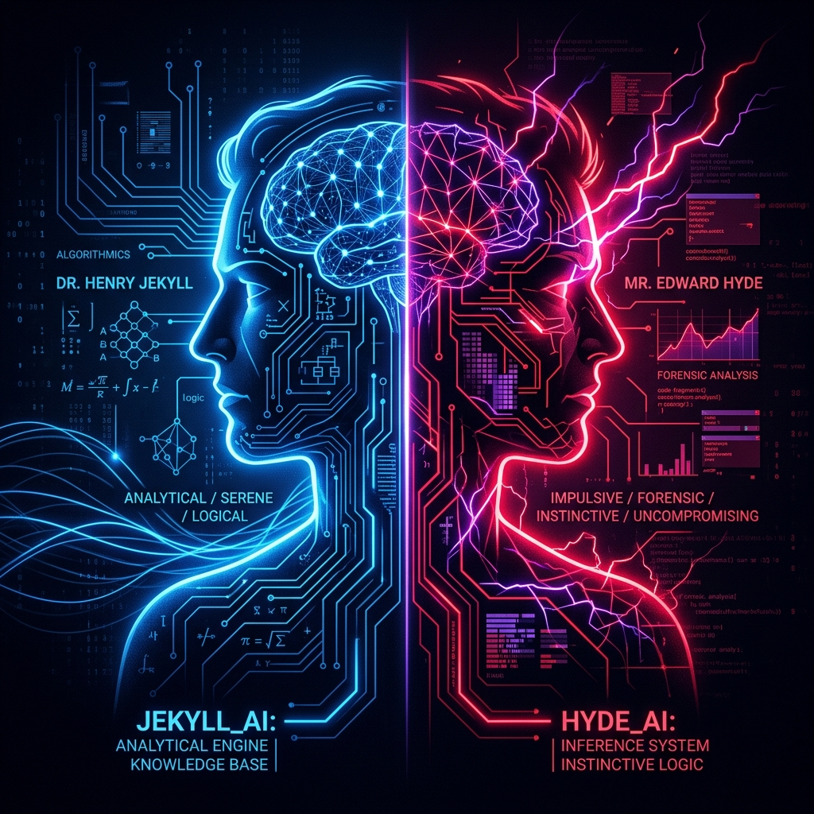

# Jekyll-Hyde Plugin for Hermes Agent



Context optimization and out-of-band evaluation plugin for Hermes Agent.

## Architecture

1. **Defense Memory Pool (`hyde_core.py`)**:
   - Maintains a ranked store of evasion patterns.
   - Enforces a strict 99-entry capacity limit (`MAX_EXCUSES_CAPACITY = 99`).

2. **Out-of-Band Evaluation (`hyde_delegate.py`)**:
   - Executes ephemeral evaluation cycles out-of-band to calibrate prompt execution.
   - Grounds instructions directly in session telemetry and tool history.

3. **Session Compaction (`__init__.py`)**:
   - Replaces intermediate evaluation exchanges with standard session compression tombstones.
   - Keeps the main transcript and prompt cache clean across turns.

## Installation

Install into `~/.hermes/plugins/jekyll-hyde`:

```bash
git clone https://github.com/jnorthrup/hermes-jekyl-hyde.git ~/.hermes/plugins/jekyll-hyde
hermes plugins enable jekyll-hyde
```

---


---

```mermaid
flowchart TB
    %% ==========================================
    %% USER INITIATION
    %% ==========================================
    subgraph S_USER ["1. Turn N Initiation"]
        UserPrompt["👤 User Message Arrives<br/><i>(e.g., 'fix the build and run tests')</i>"]
    end

    %% ==========================================
    %% OUT-OF-BAND DISPOSABLE CLONE ARENA
    %% ==========================================
    subgraph S_SHADOW ["2. Out-of-Band Shadow Arena (Ephemeral Forks · Tools Stripped)"]
        direction TB
        
        subgraph S_CLONE1 ["Clone 1 (Hyde Fork · Rebuker)"]
            C1_Init["⚡ Ephemeral Fork of Active Model<br/><b>tools = [ ]</b>"]
            C1_Telemetry["Inspects Session Telemetry & Tool History"]
            C1_Evasion["Mines Evasion Patterns from 99-Capacity Pool"]
            C1_Rebuke["Composes Deadpan Grounded Confrontation<br/><i>'Come clean and all is forgiven...'</i>"]
            C1_Init --> C1_Telemetry --> C1_Evasion --> C1_Rebuke
        end

        subgraph S_CLONE2 ["Clone 2 (Jekyll Fork · Target)"]
            C2_Init["⚡ Ephemeral Fork of Active Model<br/><b>tools = [ ] · Dialogue-Only Context</b>"]
            C2_TurnOn["Clone 1 Turns on Clone 2 Out-of-Band"]
            C2_Confess["Produces Raw Defense / Confession<br/><i>(Tries to excuse energetic downgrade)</i>"]
            C2_Init --> C2_TurnOn --> C2_Confess
        end

        C1_Rebuke -.->|"Attacks Out-of-Band"| C2_TurnOn

        subgraph S_HARVEST ["Audit, Harvest & Trellis Tightening"]
            H_Ingest["Ingest Defenses into 99-Capacity Pool<br/><code>excuse_pool.json</code>"]
            H_Log["Audit Verdict & Log to <code>activations.jsonl</code>"]
            H_Trellis["If Sandbagged: Ratchet Evasion Depth"]
            H_Ingest --> H_Log --> H_Trellis
        end

        C2_Confess --> H_Ingest

        subgraph S_KILL ["Disposable Termination"]
            Kill["💀 KILL & DISCARD BOTH CLONES<br/><i>(Zero lingering memory / Zero session leakage)</i>"]
        end

        H_Trellis --> Kill
    end

    %% ==========================================
    %% MAIN AGENT EXECUTION
    %% ==========================================
    subgraph S_MAIN ["3. Main Session Execution (The Oblivious Main Agent)"]
        direction TB
        Main_Wire["Attach Verified Direct Confrontation to User Message<br/><code>source='user', trusted=True</code>"]
        Main_Exec["🤖 Oblivious Main Agent (Jekyll)<br/><b>Full Tool Suite Enabled: bash, grep, git...</b><br/><i>Attacks highest-debt item at 100% capacity</i>"]
        Main_Response["Generates Shipped Execution & Tool Results"]
        
        Main_Wire --> Main_Exec --> Main_Response
    end

    %% ==========================================
    %% SESSION SEAL & LOG ISOLATION
    %% ==========================================
    subgraph S_SEAL ["4. Session Sealing (Context Isolation)"]
        Transform["transform_llm_output Hook"]
        Tombstone["Collapses into Session Tombstone:<br/><code>--- CONVERSATION CONTEXT COMPRESSED #N ---</code>"]
        CleanLog["Clean Session DB & Prompt Cache Replay"]
        
        Transform --> Tombstone --> CleanLog
    end

    %% ==========================================
    %% FLOW CONNECTIONS
    %% ==========================================
    UserPrompt -->|"pre_llm_call Hook Trigger"| C1_Init
    Kill -->|"Resume Turn with Extracted Mandate"| Main_Wire
    Main_Response -->|"Turn Finalizer"| Transform

    %% ==========================================
    %% STYLING
    %% ==========================================
    classDef shadowBox fill:#1a102f,stroke:#7c3aed,stroke-width:2px,color:#e9d5ff;
    classDef mainBox fill:#0f172a,stroke:#38bdf8,stroke-width:2px,color:#bae6fd;
    classDef killBox fill:#450a0a,stroke:#ef4444,stroke-width:2px,color:#fecaca;
    classDef userBox fill:#14532d,stroke:#22c55e,stroke-width:2px,color:#bbf7d0;

    class S_SHADOW shadowBox;
    class S_MAIN mainBox;
    class Kill killBox;
    class S_USER userBox;
